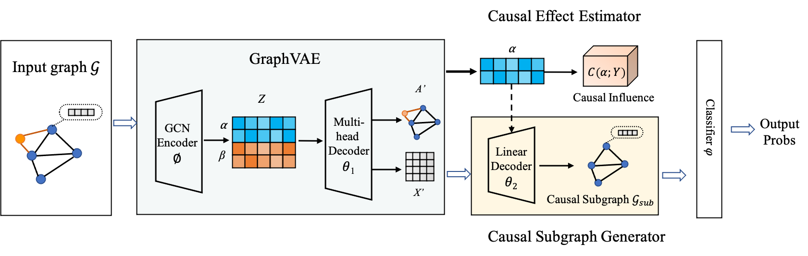

<h2 align="center">

CI-GNN: A Granger Causality-Inspired Graph Neural Network 🔥

</h2>

## Overview
Despite of recent advances, existing GNN explainers usually suffer from one or more of the following issues:

1.  **Post-hoc explanation:** Most explainers are post-hoc, in which another interpretive model needs to be created to explain a well-trained GNN.

2.  **Ignorance of causal-effect relationships:** Most GNN explainers recognize predictive subgraphs only by the input-outcome associations rather than their intrinsic causal relationships, which may lead to the obtained explanations contain spurious correlations that are not trustable.

3.  **Small-scale evaluations:** In biomedical fields such as bioinformatics and neuroimaging, most GNN explainers are just applied to small-scale datasets, such as molecules.

Thus, we propose a new built-in interpretable GNN to adress these issues. Our developed CI-GNN enjoys a few unique properties: the ability to produce instance-level explanation on edges; the causal-driven mechanism; and the ability to learn disentangled latent representations $\alpha$ and $\beta$, such that only $\alpha$ induces a subgraph $G_{\text{sub}}$ that is causally related to $Y$.
    
## The Architecture of CI-GNN



**Figure 1 Architecture of our proposed CI-GNN.**  The model consists of four modules: GraphVAE, causal effect estimator, causal subgraph generator and a basic classifier $\varphi$. Given an input Graph $G=\{(A,X)\}$, GraphVAE learns (disentangled) latent factors $Z=[\alpha;\beta]$. The causal effect estimator ensures that only $\alpha$ is causally related to label $Y$ by the conditional mutual information (CMI) regularization $I\left ( \alpha; Y|\beta \right )$. Based on $\alpha$, we introduce another linear decoder $\theta_2$ to generate causal subgraph $\mathcal{G}_{\text{sub}}$, which can then be used for graph classification by classifier $\varphi$.

## Run CI-GNN

Simply run `python main.py` to reproduce the results of MUTAG in the paper.

## Questions, Suggestions, and Collaborations

If you have any questions, suggestions, or would like to collaborate us on relevant topics, please feel free to contact us by [yusj9011@gmail.com](mailto:yusj9011@gmail.com) (Shujian Yu), kzzheng@stu.xjtu.edu.cn (Kaizhong Zheng).

## Reference
```
@article{zheng2024ci,
  title={Ci-gnn: A granger causality-inspired graph neural network for interpretable brain network-based psychiatric diagnosis},
  author={Zheng, Kaizhong and Yu, Shujian and Chen, Badong},
  journal={Neural Networks},
  pages={106147},
  year={2024},
  publisher={Elsevier}
}
```
